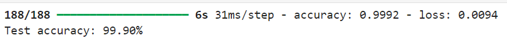
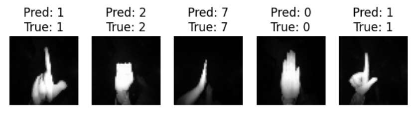
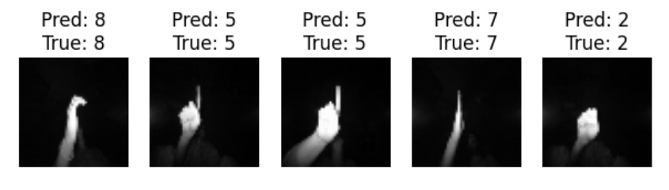

# Hand Gesture Recognition Using Convolutional Neural Networks (CNN)

## Overview

This project implements a Convolutional Neural Network (CNN) to recognize and classify different hand gestures from image data. The model is designed to enable intuitive human-computer interaction and gesture-based control systems.

## Table of Contents

- [Introduction](#introduction)
- [Dataset](#dataset)
- [Model Architecture](#model-architecture)
- [Training](#training)
- [Evaluation](#evaluation)
- [Results](#results)
- [License](#license)

## Introduction

Hand gesture recognition is a key technology in the field of Human-Computer Interaction (HCI). This project demonstrates a deep learning approach using CNN to classify hand gestures from images.

## Dataset

The dataset used for training and testing the model consists of images of different hand gestures. The images are grayscale, with a resolution of 50x50 pixels.

- **Classes**: [List of gesture classes]
- **Number of Images**: 20,000

## Model Architecture

The CNN model consists of multiple convolutional layers followed by max-pooling layers, and finally, fully connected layers that output the probabilities for each gesture class.

### Layers:
- **Convolutional Layers**: Extract features from the images.
- **Max-Pooling Layers**: Downsample the spatial dimensions of the feature maps.
- **Fully Connected Layers**: Classify the gestures based on the extracted features.
- **Activation Function**: ReLU for hidden layers, Softmax for the output layer.

## Training

The model was trained on the dataset using the following parameters:

- **Optimizer**: Adam
- **Loss Function**: Categorical Cross-Entropy
- **Batch Size**: 32
- **Epochs**: 7

The training process involved splitting the dataset into training and validation sets to monitor the model's performance and prevent overfitting.

## Evaluation

The model's performance was evaluated using a separate test set. The accuracy was calculated to assess the model's effectiveness in recognizing gestures.

### Sample Results:
- **Accuracy**: 99.90%

## Results

The trained model successfully recognizes and classifies hand gestures with high accuracy. Below is a sample visualization of the model's predictions:

## License

This project is licensed under the MIT License - see the [LICENSE](LICENSE) file for details.
